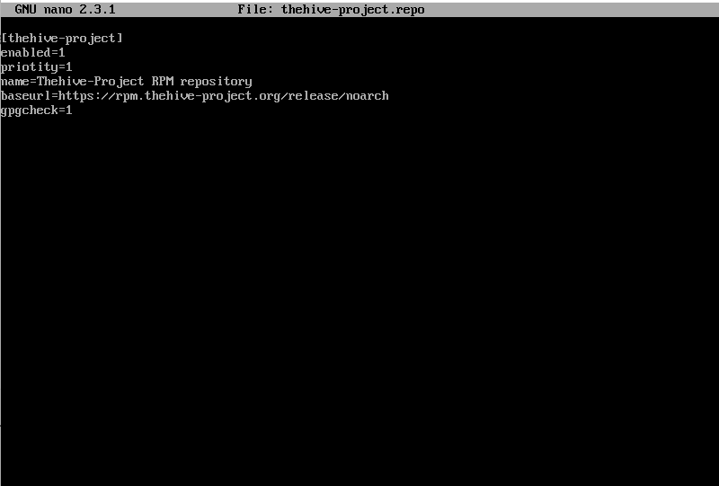
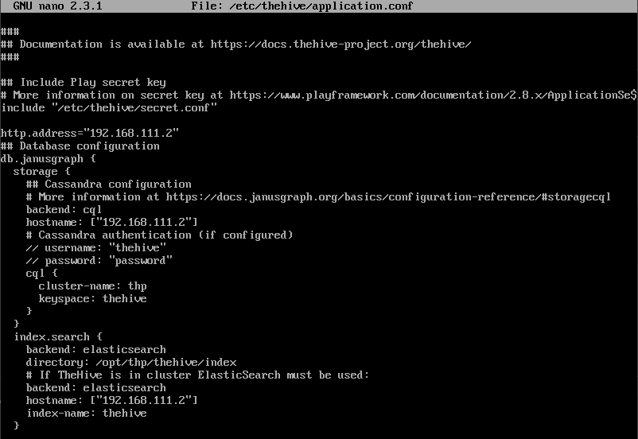
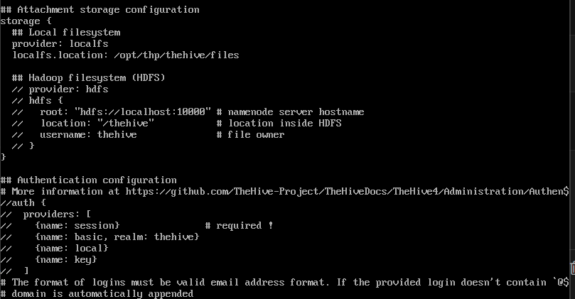

**INSTALLING THEHIVE ON CENTOS**

**THEHIVE**

NOTE: This is an instruction for installing TheHive on CentOS.

**REQUIREMENTS**
```
- CentOS vm
- Java Installation
- Apache Cassandra Installation
- Elasticsearch Installation
- Thehive Installation.
```

**STEPS**

["CentOS VM Installation"](https://github.com/bintMA/incident-management-team-02/blob/main/Procedures/2025-02-21-install-misp-on-ubuntu22.4.md)

JAVA INSTALLATION

Run this command to install Java

```
sudo yum install -y java-1.8.0-openjdk-headless.x86_64
echo JAVA_HOME="/var/lib/jvm/jre-1.80">> /etc/environment JAVA_HOME="/usr/lib/jvm/jre-1.8.0"
```

APACHE CASSANDRA INSTALLATION

Download Cassandra Key 

```
rpm --import https://downloads.apache.org/cassandra/KEYS
```

Apache Repository Addition for Cassandra

```
/etc/yum.repos.d/cassandra.repo
```
Enter the below configuration


**POSSIBLE PROBLEM:** gpgkey refusing to work.

**SOLUTION:** Install without gpgkey

Install Without Key

```
yum clean all
yum makecache
yum install cassandra -y -nogpgcheck
```

Configure Cassandra
```
sudo nano /etc/cassandra/default.conf/cassandra.yaml
```
Add the following to your configuration
```
cluster_name: 'thp'
seeds: "vm ip address"
listening_address: vm address
rpc_address: vm address
rpc_port:9160
```
 Enable and Restart Cassandra

 ```
 sudo systemctl enable cassandra
 sudo systemctl restart cassandra
 ```

 ELASTICSEARCH INSTALLATION

 Create Elasticsearch Repo

 ```
 rpm --import https://artifacts.elastic.co/CPG-KEY-elasticsearch

 sudo nano /etc/yum.repos.d/elasticsearch.repo
 ```
 Enter Configuration

 

 Make Cache
 ```
 yum makecache
 ```

 Install Elasticsearch
 ```
 sudo yum install --enablerepo=elasticsearch elasticsearch
 ```
 Configure Elasticsearch
 ```
 sudo nano /etc/elasticsearch/elasticsearch.yml
 ```

 ```
 node.name: hive-mode
 path.data: /var/lib/elasticsearch
 path.logs: /var/log/elasticsearch
 thread_pool.search.queue_size: 100000
 network.host:vm-ip
 http.port:9200
 discovery.type: single-node
 ```
Set Permissions

```
sudo chown -R elasticsearch:elasticsearch /etc/elasticsearch
sudo chmod -R 755 /etc/elasticsearch
```
Enable and Restart Elasticsearch

```
sudo systemctl enable elasticsearch
sudo systemctl restart elasticsearch
```

THEHIVE INSTALLATION

Create Thehive Repo
```
/etc/yum.repos.d/strangebee.repo
```
Add the below configuration



Install Thehive4

```
yum install thehive4 --nogpgcheck
```
Create Local Storage Directory

```
sudo mkdir -p /opt/thp/thehive/files
```
Change Directory Ownership

```
chown -R /opt/thp/thehive/files
```

Configure Thehive

```
sudo nano /etc/thehive/application.conf
```




Enable and Restart thehive

```
sudo systemctl enable thehive
sudo systemctl restart thehive
```

Access Thehive Dashboard Using The Provided Login Data

```
Username: admin
Password: secret
```
